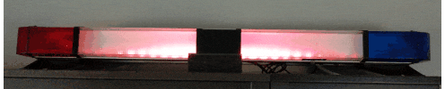

# Retrofit Police Lightbar - LEDs & Audio Visualizer

This is a light-weight program that replaced the incandescent bulbs of an [older police lightbar](https://en.wikipedia.org/wiki/Emergency_vehicle_lighting) with an internet-controlled LED strip. This retrofitting is only intended for home-use. It retains the standard red/white/blue flashers, but also adds many more color capabilities to have it light up the room!

***Disclaimer:** This is a personal project that I put together for my father-in-law. He had a police lightbar that he wanted help fixing up, and lightbars require complex, expensive controllers (for all the different patterns they do, [many wires are required](github-docs/lightbar-previous-wiring.png)). Rather than spending $200+ for a used controller, this was a great opportunity to attach a Raspberry Pi to an LED strip & a microphone.*

***Reason for disclaimer:** I'm not sure if anyone else would be interested in a setup like this. If there is interest, we'd probably want to extract the LED parameters & microphone settings. The configurations are hard-coded, but if others want to use this we should make them easier to alter. If you're interested, contact me! The more, the merrier!*

## Features

* Web interface to control 15 different light patterns
* Physical buttons to cycle through presets, adjust brightness, and turn on/off
* Three sound-sensing modes that adjust lights based on music, sound or noises
* Auto-on based on time of day
* Auto-off after an adjustable number of hours

## Screenshots & Examples

| Demo of | Lights In Action |
| ----------------- | -------------------- |
| <h4>Blink</h4>  | <h4>Chase</h4>  |
| <h4>Color Cycle (rainbow color defaults)</h4>  | <h4>Comet</h4>  |
| <h4>Pop</h4>  | <h4>Pulse</h4>  |
| <h4>Red Blue Flashers</h4>  | <h4>Red White Blue Flashers</h4>  |
| <h4>Unicorn Party 1 - Rainbow</h4>  | <h4>Unicorn Party 2 - Rainbow Chase</h4>  |
| <h4>Unicorn Party 3 - Rainbow Comet</h4>  | <h4>Unicorn Party 4 - Rainbow Sparkle</h4>  |

| Light Based Examples | Powered by [Scott Lawson's library](https://github.com/scottlawsonbc/audio-reactive-led-strip) | You'll have to imagine the music playing because of GIFs... |
| ---- | --- | --- |
|  |  |  |

## Web Interface

## Instructions

Here's the crude version of the work that I did to make this work:
1. I removed the wiring & lighting from the lightbar.
2. Follow [Adafruit's Guide to NeoPixel on Raspberry Pi](https://learn.adafruit.com/neopixels-on-raspberry-pi/raspberry-pi-wiring) to attach a Raspberry Pi to an strip of 60 LEDs.
3. Wire a [1x4 Keypad](https://www.adafruit.com/product/1332) to the bottom to allow physical button control. 
4. Install the [USB Desktop Microphone](https://www.amazon.com/dp/B08CF2YP8M) to the Pi, and mount it to the bottom of the lightbar. 
5. Disable all not-critical processes on the Pi, and setup a script to run `app.py` as a service.
6. Enjoy a lightbar that brings people together!

## Hardware Used

* [Whelen Lightbar - Casing Only, circa 1995](https://www.whelen.com/product-category/lighting/lightbars/)
* [Raspberry Pi - Model 3 or newer](https://www.raspberrypi.com/)
* [USB Desktop Microphone](https://www.amazon.com/dp/B08CF2YP8M)
* [Adafruit NeoPixel LED Strip](https://www.adafruit.com/product/1376)
* [1x4 Keypad](https://www.adafruit.com/product/1332)

## Credits & Special Thanks

* [Adafruit's Guide to NeoPixel on Raspberry Pi](https://learn.adafruit.com/neopixels-on-raspberry-pi/raspberry-pi-wiring)
* [NES.css - Theme of the Web Interface](https://nostalgic-css.github.io/NES.css/)
* [Scott Lawson's Amazing Audio Reactive LED Strip](https://github.com/scottlawsonbc/audio-reactive-led-strip)
